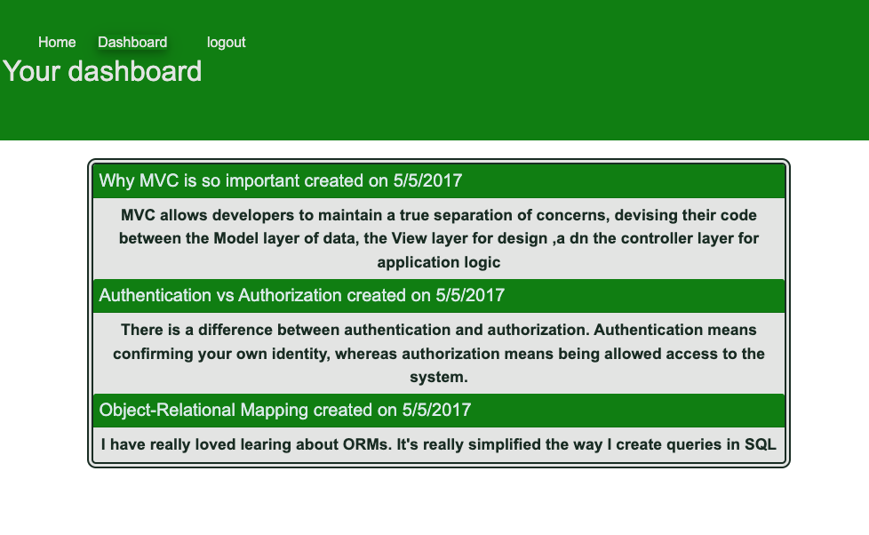

# TechBlog

- The URL of the functional, deployed, mobile responsive application:
- https://gentle-hollows-22810.herokuapp.com/

## Table of Contents

- [Descripttion](#descripttion)
- [Installation](#installation)
- [Mock-Up](#mock-up)
- [Questions](#questions)

---

## Descripttion

Writing about tech can be just as important as making it. Developers spend plenty of time creating new applications and debugging existing codebases, but most developers also spend at least some of their time reading and writing about technical concepts, recent advancements, and new technologies.

This CMS-style blog site is where developers can publish their blog posts and comment on other developers’ posts as well. This app will follow the MVC paradigm in its architectural structure, using Handlebars.js as the templating language, Sequelize as the ORM, and the express-session npm package for authentication.

The developers who writes about tech
the developers WANT a CMS-style blog site
SO THAT the developers can publish articles, blog posts, and their thoughts and opinions

GIVEN a CMS-style blog site
WHEN the developers visit the site for the first time
THEN the developers are presented with the homepage, which includes existing blog posts if any have been posted; navigation links for the homepage and the dashboard; and the option to log in

WHEN the developers click on the homepage option
THEN the developers are taken to the homepage

WHEN the developers click on any other links in the navigation
THEN the developers are prompted to either sign up or sign in

WHEN the developers choose to sign up
THEN the developers are prompted to create a username and password

WHEN the developers click on the sign-up button
THEN their user credentials are saved and the developers are logged into the site

WHEN the developers revisit the site at a later time and choose to sign in
THEN the developers are prompted to enter their usernames and passwords

WHEN the developers are signed in to the site
THEN the developers see navigation links for the homepage, the dashboard, and the option to log out

WHEN the developers click on the homepage option in the navigation
THEN the developers are taken to the homepage and presented with existing blog posts that include the post title and the date created

WHEN the developers click on an existing blog post
THEN the developers are presented with the post title, contents, post creator’s username, and date created for that post and have the option to leave a comment

WHEN the developers enter a comment and click on the submit button while signed in
THEN the comment is saved and the post is updated to display the comment, the comment creator’s username, and the date created

WHEN the developers click on the dashboard option in the navigation
THEN the developers are taken to the dashboard and presented with any blog posts the developers have already created and the option to add a new blog post

WHEN the developers click on the button to add a new blog post
THEN the developers are prompted to enter both a title and contents for their blog posts

WHEN the developers click on the button to create a new blog post
THEN the titles and contents of their posts are saved and the developers are taken back to an updated dashboard with their new blog posts

WHEN the developers click on one of their existing posts in the dashboard
THEN the developers are able to delete or update their posts and taken back to an updated dashboard

WHEN the developers click on the logout option in the navigation
THEN the developers are signed out of the site

WHEN the developers are idle on the site for more than a set time
THEN the developers are able to view comments but the developers are prompted to log in again before I can add, update, or delete comments

---

## Installation

This application’s folder structure must follow the Model-View-Controller paradigm.

Use the [express-handlebars](https://www.npmjs.com/package/express-handlebars) package to implement Handlebars.js for Views

Use the [MySQL2](https://www.npmjs.com/package/mysql2)

Use the [Sequelize](https://www.npmjs.com/package/sequelize) packages to connect to a MySQL database for your Models, and create an Express.js API for Controllers.

Use the [dotenv package](https://www.npmjs.com/package/dotenv) to use environment variables

Use the [bcrypt package](https://www.npmjs.com/package/bcrypt) to hash passwords

Use the [express-session](https://www.npmjs.com/package/express-session) and the [connect-session-sequelize](https://www.npmjs.com/package/connect-session-sequelize) packages to add authentication.

Use the [express-session](https://www.npmjs.com/package/express-session) package stores the session data on the client in a cookie.

---

## Mock-Up

The following images show the web application's appearance and functionality:
 
 
 
 
 
 

---

## Questions

Feel free to reach out via Github or email with any questions.  
[Github](https://github.com/kayjinyi)  
[email](mailto:kayjinyi@gmail.com)

---
